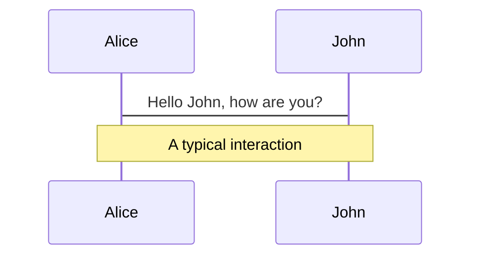
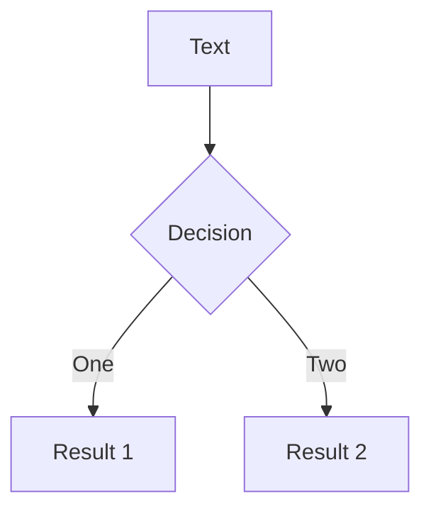
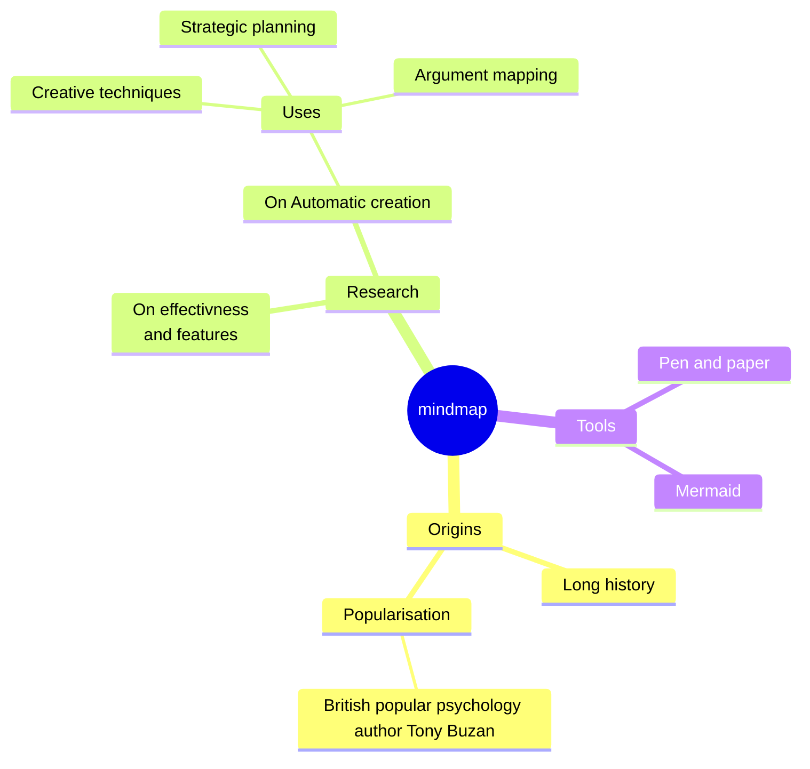
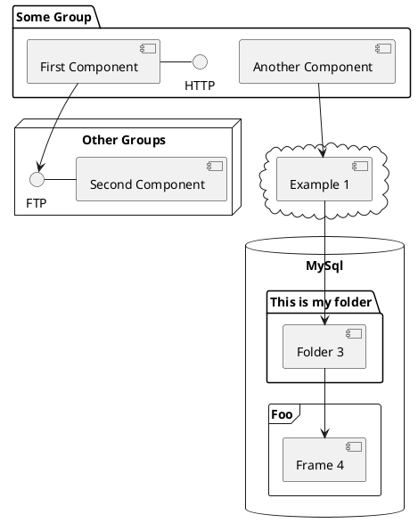

---
# try also 'default' to start simple
theme: seriph
# random image from a curated Unsplash collection by Anthony
# like them? see https://unsplash.com/collections/94734566/slidev
background: https://source.unsplash.com/collection/94734566/1920x1080
# apply any windi css classes to the current slide
class: 'text-center'
# https://sli.dev/custom/highlighters.html
highlighter: shiki
# show line numbers in code blocks
lineNumbers: false
# some information about the slides, markdown enabled
info: |
  ## Slidev Starter Template
  Presentation slides for developers.

  Learn more at [Sli.dev](https://sli.dev)
# persist drawings in exports and build
drawings:
  persist: false
# page transition
transition: slide-left
# use UnoCSS
css: unocss
---

# Amplificatori

Presentazione sugli amplificatori Hi-Fi

---
transition: fade-out
---

# Che cos'è un AMPLIFICATORE

Si parla di amplificatori quanto il guadagno di tensione o corrente  è **MAGGIORE** di **UNO**.

Gli amplificatori, in elettronica, sono dispositivi che sono in grado amplificare ovvero aumentare il segnale in ingresso. Il guadagno che crea può essere misurato con diverse unità di misura o addirittura **adimensionale**.<br><br>L'unità di misura più utilizzata e il decibel ***dB*** che è un sottomultiplo delle ***unità logaritmiche*** utilizzate per rappresentare scale estese in poco spazio. 

<center>

</center>

<style>
h1 {
  background-color: #2B90B6;
  background-image: linear-gradient(45deg, #4EC5D4 10%, #146b8c 20%);
  background-size: 100%;
  -webkit-background-clip: text;
  -moz-background-clip: text;
  -webkit-text-fill-color: transparent;
  -moz-text-fill-color: transparent;
}
</style>

---
layout: default
---

# Come si calcola l'amplificazione
Le formule per il calcolo dell'amplificazione sono uguali a quelle dell'attenuazione infatti derivano entrambi dal calcola delle guadagno. 

Amplificazione [*adimensionale*]:&emsp; $A = Uscita / Entrata$
<br><br><br>
Amplificazione [*dB*]:&emsp; $A[dB] = 10 * log10(A[adimensionale])$
<br><br>

Inoltre per i valori relativi alle fraquenze radio ***RF*** vengono usati i ***dBm*** o i ***dBW***.
<br><br>
Amplificazione [*dBm*]:&emsp; $A[dB] = 10 * log10(P / 1mW)$
<br><br><br>
Amplificazione [*dBW*]:&emsp; $A[dB] = 10 * log10(P / 1W)$
<br><br>
Dove 1mW e 1W sono i valori di riferimento.

---

# Tipi di amplificatori
Vari tipi di amplificatori.

Gli amplificatori si distinguono in più macro-settori:
- Digitale
- Analogico
- In continua
- In alternata
- Attivo
- Passivo

<div class="grid grid-cols-2 flex justify-center space-around space-x-10">
  
  
  
</div>


---
transition: slide-up

level: 2
---

# Costruiamo un amplificatore a transistor

Per costruire un amplificatore a transistor MOSFET, abbiamo bisogno di un transistor di tipo N, una resistenza da 20KOhm, un condensatore elettrolitico da 100 uF, uno speaker e un jack di ingresso.

<center>
  
</center>
---

# Aggingiamo il volume e il tasto di accensione

Il nostro amplificatore adesso è molto basilare, non supporta il volume e non si può spegnere senza staccare l'alimentazione. Per fare queste modifiche prendiamo un potenziometro da 20Kohm e sostituiamolo alla resistenza

<center>
  
</center>
---

---

# Components

<div grid="~ cols-2 gap-4">
<div>

You can use Vue components directly inside your slides.

We have provided a few built-in components like `<Tweet/>` and `<Youtube/>` that you can use directly. And adding your custom components is also super easy.

```html
<Counter :count="10" />
```

<!-- ./components/Counter.vue -->
<Counter :count="10" m="t-4" />

Check out [the guides](https://sli.dev/builtin/components.html) for more.

</div>
<div>

```html
<Tweet id="1390115482657726468" />
```

<Tweet id="1390115482657726468" scale="0.65" />

</div>
</div>

<!--
Presenter note with **bold**, *italic*, and ~~striked~~ text.

Also, HTML elements are valid:
<div class="flex w-full">
  <span style="flex-grow: 1;">Left content</span>
  <span>Right content</span>
</div>
-->


---
class: px-20
---

# Themes

Slidev comes with powerful theming support. Themes can provide styles, layouts, components, or even configurations for tools. Switching between themes by just **one edit** in your frontmatter:

<div grid="~ cols-2 gap-2" m="-t-2">

```yaml
---
theme: default
---
```

```yaml
---
theme: seriph
---
```


</div>

Read more about [How to use a theme](https://sli.dev/themes/use.html) and
check out the [Awesome Themes Gallery](https://sli.dev/themes/gallery.html).

---
preload: false
---

# Animations

Animations are powered by [@vueuse/motion](https://motion.vueuse.org/).

```html
<div
  v-motion
  :initial="{ x: -80 }"
  :enter="{ x: 0 }">
  Slidev
</div>
```

<div class="w-60 relative mt-6">
  <div class="relative w-40 h-40">
    
    
    
  </div>

  <div
    class="text-5xl absolute top-14 left-40 text-[#2B90B6] -z-1"
    v-motion
    :initial="{ x: -80, opacity: 0}"
    :enter="{ x: 0, opacity: 1, transition: { delay: 2000, duration: 1000 } }">
    Slidev
  </div>
</div>

<!-- vue script setup scripts can be directly used in markdown, and will only affects current page -->
<script setup lang="ts">
const final = {
  x: 0,
  y: 0,
  rotate: 0,
  scale: 1,
  transition: {
    type: 'spring',
    damping: 10,
    stiffness: 20,
    mass: 2
  }
}
</script>

<div
  v-motion
  :initial="{ x:35, y: 40, opacity: 0}"
  :enter="{ y: 0, opacity: 1, transition: { delay: 3500 } }">

[Learn More](https://sli.dev/guide/animations.html#motion)

</div>

---

# LaTeX

LaTeX is supported out-of-box powered by [KaTeX](https://katex.org/).

<br>

Inline $\sqrt{3x-1}+(1+x)^2$

Block
$$
\begin{array}{c}

\nabla \times \vec{\mathbf{B}} -\, \frac1c\, \frac{\partial\vec{\mathbf{E}}}{\partial t} &
= \frac{4\pi}{c}\vec{\mathbf{j}}    \nabla \cdot \vec{\mathbf{E}} & = 4 \pi \rho \\

\nabla \times \vec{\mathbf{E}}\, +\, \frac1c\, \frac{\partial\vec{\mathbf{B}}}{\partial t} & = \vec{\mathbf{0}} \\

\nabla \cdot \vec{\mathbf{B}} & = 0

\end{array}
$$

<br>

[Learn more](https://sli.dev/guide/syntax#latex)

---

# Diagrams

You can create diagrams / graphs from textual descriptions, directly in your Markdown.

<div class="grid grid-cols-3 gap-10 pt-4 -mb-6">









</div>

[Learn More](https://sli.dev/guide/syntax.html#diagrams)

---
src: ./pages/multiple-entries.md
hide: false
---

---
layout: center
class: text-center
---

# Learn More

[Documentations](https://sli.dev) · [GitHub](https://github.com/slidevjs/slidev) · [Showcases](https://sli.dev/showcases.html)

---
layout: end
---

